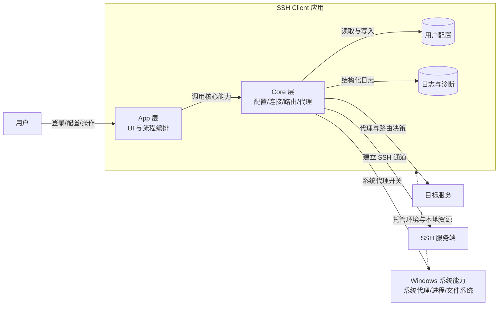
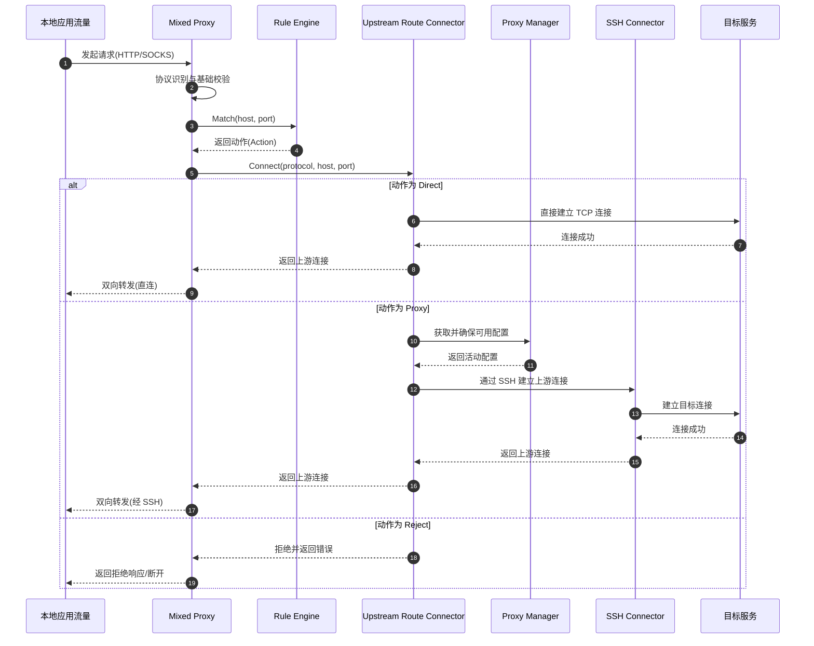

# SSH Client 架构指南（开发者全局视图）

> 本文档面向后续开发者，目标是帮助你在较短时间内建立全局认知：
> 这个系统解决什么问题、如何分层协作、关键链路如何运转、改动会影响哪里。

---

## 1. 文档定位

本文件回答三类问题：
- 为什么这样设计（目标与约束）。
- 系统如何工作（核心流程与边界）。
- 如何安全演进（扩展点、风险点、验证方式）。

本文件不追踪类级别细节。实现细节以代码与测试为准。

---

## 2. 系统使命与非目标

### 2.1 系统使命
- 提供稳定的桌面化 SSH 连接管理体验。
- 让代理路由决策对用户可见、可控、可追踪。
- 在保证主链路可靠的前提下持续扩展能力。

### 2.2 当前非目标
- 不追求全协议代理覆盖（优先稳定主链路）。
- 不默认启用高风险网络能力（例如会影响安全边界的功能）。
- 不将 UI 层与网络细节耦合在一起。

---

## 3. 系统上下文（Context）

从系统边界看，SSH Client 位于本地运维工具域，主要交互对象如下：

1. 用户：配置连接、登录登出、查看日志、控制行为偏好。
2. 目标 SSH 服务端：承载认证与转发通道。
3. 本地应用流量来源：通过本地代理进入路由决策。
4. 操作系统（Windows）：系统代理开关、进程生命周期、文件系统。

简化上下文图：

```text
User -> WPF App -> Core Services -> SSH Server
                 -> Local Mixed Proxy -> Target Hosts
                 -> Windows Proxy Settings / Local File System
```

架构图（高层）：



---

## 4. 逻辑架构分层

系统采用“应用层 + 核心层”双层架构，并通过依赖注入连接。

### 4.1 应用层（App）
- 职责：交互编排、生命周期管理、状态呈现、系统集成。
- 关注点：用户意图、窗口行为、命令触发、主流程控制。

### 4.2 核心层（Core）
- 职责：配置读写、规则判定、连接生命周期、代理与转发能力。
- 关注点：网络行为正确性、路由一致性、容错与可测试性。

### 4.3 分层约束
- App 可以依赖 Core，Core 不依赖 App。
- UI 不直接操纵底层网络细节，通过服务抽象进入核心能力。
- 规则决策、连接执行、配置持久化属于 Core 主责。

---

## 5. 核心能力地图

可以把系统拆成 5 条主能力链：

1. 配置链：读取配置 -> 归一化 -> 选择生效配置 -> 持久化。
2. 连接链：登录触发 -> 建立 SSH 通道 -> 维护连接状态。
3. 路由链：请求进入 -> 规则匹配 -> 动作决策（代理/直连/拒绝）。
4. 代理链：启动监听 -> 协议识别 -> 上游连接 -> 双向转发。
5. 可观测链：结构化日志 -> UI 实时日志 -> 启动诊断日志。

这 5 条链路共同构成系统主干，任一改动都应明确影响哪条链路。

---

## 6. 关键运行流程（Runtime）

### 6.1 启动流程
1. 应用初始化宿主与依赖注入容器。
2. 初始化日志体系与全局异常捕获。
3. 读取配置并显示主窗口。

关键点：
- 配置采用统一优先级模型（用户配置优先，内置配置回退）。
- 启动阶段异常必须可观测，避免静默失败。

### 6.2 登录与代理开启流程
1. 用户发起登录。
2. 系统执行配置合法性检查并建立连接。
3. 连接成功后启动本地混合代理监听。
4. 后续流量按规则进入路由链。

关键点：
- 代理不是默认常驻启动，而是登录后按需启动。
- 路由链与连接链解耦，避免 UI 直接承担网络复杂性。

### 6.3 请求路由流程
1. 流量进入单端口混合代理。
2. 协议识别（HTTP/SOCKS）。
3. 规则引擎返回动作。
4. 执行动作：直连、通过 SSH 上游连接、或拒绝。

请求时序图（登录后典型代理请求）：



关键点：
- 存在兜底规则，避免“隐式默认行为”导致不可预期路由。
- 防止代理自环（请求回到本地代理端点）。

### 6.4 退出流程
1. 触发有序停机。
2. 停止后台代理与连接资源。
3. 释放宿主资源并退出。

关键点：
- 采用确定性清理路径，避免退出过程异步放飞导致残留资源。

---

## 7. 配置与状态模型

### 7.1 配置来源策略
- 主配置：`%LOCALAPPDATA%/AlexSSHClient/appsettings.json`
- 回退配置：应用目录中的 `appsettings.json`

### 7.2 配置一致性原则
- 运行时配置读取与宿主配置读取采用一致优先级。
- 配置写入采用安全写入策略，降低异常中断导致的损坏风险。

### 7.3 连接状态（概念）
```text
LoggedOut -> Connecting -> LoggedIn -> LoggingOut -> LoggedOut
```

状态切换要求：
- 任意失败都必须回到可恢复状态。
- UI 状态与真实连接状态保持一致，不允许“显示已连但实际未连”。

---

## 8. 并发与生命周期治理

系统并发治理以“串行化关键生命周期操作”为核心：
- 启停路径通过门控机制避免并发冲突。
- 代理与连接清理遵循可取消、可等待、可回收原则。

生命周期原则：
- 启动、登录、代理启动、退出是四个一级生命周期事件。
- 每个事件都应具备显式日志边界，便于问题追踪。

---

## 9. 可靠性设计要点

当前可靠性设计聚焦以下策略：

1. 防错输入处理：
说明：对异常握手、无效配置等输入进行降级处理，避免后台任务失控。

2. 路由兜底：
说明：规则链包含最终兜底动作，减少未命中时的歧义行为。

3. 有序停机：
说明：退出流程优先完成资源清理，降低端口占用与状态残留。

4. 可恢复失败：
说明：连接失败与代理失败需保留后续重试能力，不进入不可恢复状态。

---

## 10. 可观测性设计

可观测性分三层：
- 结构化日志：用于开发与运维诊断。
- UI 实时日志：用于用户可见反馈。
- 启动探针日志：用于启动早期故障定位。

设计目标：
- 关键链路必须“有日志边界 + 有上下文字段 + 可定位阶段”。

---

## 11. 测试策略（架构视角）

测试分层建议：

1. 单元测试：
覆盖规则判定、配置行为、连接与路由决策。

2. 边界测试：
覆盖协议异常输入、生命周期临界条件、配置损坏回退。

3. 集成与压力测试：
覆盖端到端代理链路、并发负载、长期稳定性。

原则：
- 先验证主链路正确性，再引入性能和耐久性门禁。

---

## 12. 扩展与演进指南

新增能力时建议先回答四个问题：

1. 新能力属于哪条主链路（配置/连接/路由/代理/可观测）？
2. 会改变哪些状态转换和失败路径？
3. 是否引入新的安全边界或资源生命周期？
4. 需要新增哪些测试与日志字段来保证可运维？

常见扩展方向：
- 安全增强：身份校验、凭据保护、审计强化。
- 路由增强：更丰富规则表达与策略组合。
- 形态增强：桌面之外的服务化运行模式。

---

## 13. 已知风险与技术债（持续跟踪）

需要持续关注的架构风险：
- 规则复杂度提升后对性能与可解释性的影响。
- 多平台演进时对系统代理能力差异的处理。
- 安全能力增强时对易用性和兼容性的冲击。

建议将风险转化为可执行事项：
- 有指标、有验收条件、有回退方案。

---

## 14. 新开发者阅读路径

建议按以下顺序建立认知：

1. 先读本文件，建立全局模型。
2. 再读 README，理解运行方式与基本操作。
3. 再读重构计划，了解当前阶段与变更优先级。
4. 最后进入代码与测试，定位具体实现。

如果你要改动主链路，请先更新本文件中的“边界与流程”描述，再开始编码。

---

## 15. 文档维护约定

以下变化必须同步更新本文件：
- 分层边界变化。
- 关键运行流程变化。
- 配置优先级或生命周期模型变化。
- 质量属性优先级变化。

文档目标不是记录所有细节，而是持续维护“全局正确性”。
